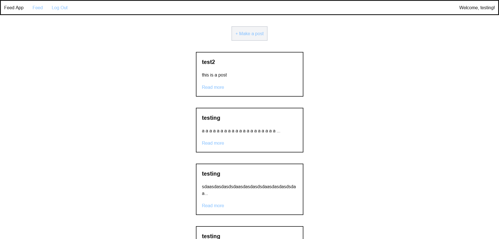

# Message Feed App 
This is an app that allows you to create accounts and post messages to a global message feed. 

Technologies: Next.js, MongoDB/mongoose 
## How to run 
Development: `npm run dev`
Production: `npm run build && npm run start`
## Demo 

